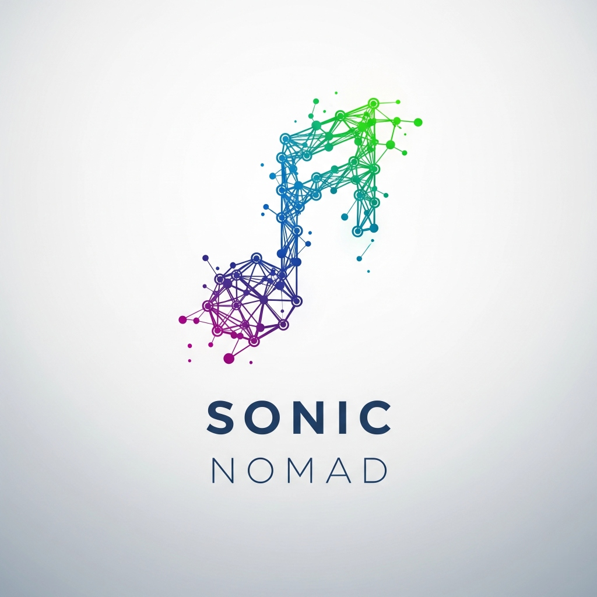

<div align="center">
  
</div>

# SonicNomad

> Visualize music genre evolution and artist relationships on an interactive infinite canvas.

SonicNomad is a mobile-first, open-source application that visually maps the macro-evolution of music genres and the interconnected relationships between artists. Explore a 2D node-based infinite canvas — build, expand, and discover "connect-the-dots" music history rather than scrolling through vertical lists.

## ✨ Features (Planned)

- 🎨 **Interactive Infinite Canvas** — Pan, zoom, and explore artist nodes connected by bezier curve edges
- 🔍 **Semantic Search** — Find any artist and expand their network in real-time
- 🌳 **Genre Evolution Mapping** — Visualize how genres branch, merge, and influence each other
- 💾 **Save & Share** — Serialize your discovery path and share it with others
- 🔐 **Authentication** — Sign in with Google, Apple, or GitHub

## 📐 Architecture

- **Flutter** (Dart) — iOS & Android
- **State Management** — BLoC pattern
- **Canvas** — `InteractiveViewer` + `CustomPaint` (no heavy graph libraries)
- **Data Sources** — [MusicBrainz](https://musicbrainz.org/) (CC0 artist metadata) + [Wikidata](https://www.wikidata.org/) (genre hierarchies via SPARQL)
- **Backend** — Firebase Spark tier ($0 operating cost)

## 🚀 Getting Started

### Prerequisites

- Flutter SDK (stable channel)
- Android Studio / Xcode
- Firebase CLI (optional, for Firebase setup)

### Setup

```bash
git clone https://github.com/shai-kappel/sonic-nomad.git
cd sonic-nomad

# Install pre-commit hooks (optional but recommended)
git config core.hooksPath .githooks

flutter pub get
flutter run --flavor dev
```

### Flavors

| Flavor | Bundle ID (Android) | Bundle ID (iOS) | Purpose |
|--------|---------------------|-----------------|---------|
| `dev`  | `com.indiedesert.sonicnomad.dev` | `com.indiedesert.SonicNomad.dev` | Development & testing |
| `prod` | `com.indiedesert.sonicnomad` | `com.indiedesert.SonicNomad` | App Store releases |

## 🗺️ Roadmap

| Milestone | Phases | Status |
|-----------|--------|--------|
| Foundation & Canvas | 1. Project Scaffolding · 2. Static Canvas & Node Rendering | ✅ Complete |
| Data Exploration | 3. MusicBrainz Integration · 4. Wikidata & Macro-Evolution | ✅ Complete |
| Persistence & Sharing | 5. Firebase Integration · 6. Deep Linking & Sharing | ⏳ Planned |
| Polish & Deployment | 7. Final Polish | ⏳ Planned |

## 📄 License

[Apache 2.0](LICENSE) — © Indie Desert

## 🤝 Contributing

Contributions welcome! This project is in early development. Please open an issue before submitting a PR.

## 📧 Contact

- **GitHub:** [@shai-kappel](https://github.com/shai-kappel)
